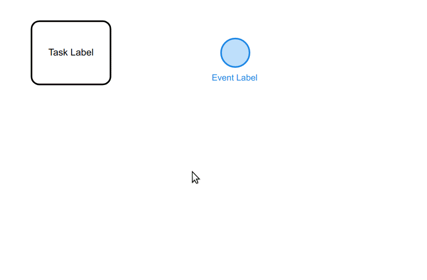

# bpmn-js Color Picker

This [bpmn-js](https://github.com/bpmn-io/bpmn-js) extension adds a simple color picker to an elements context pad. Colors are serialized to BPMN 2.0 according to the [BPMN in Color proposal](https://github.com/bpmn-miwg/bpmn-in-color).




## Features

* Add color picker to an elements context pad
* Serialize colors to BPMN 2.0
* Render colors (built-in `bpmn-js@8.7+`)


## Use Extension

Fetch `bpmn-js-color-picker` as a dependency:

```
npm install bpmn-io/bpmn-js-color-picker --save
```

Extend your BPMN modeler with colors:

```javascript
import BpmnModeler from 'bpmn-js/lib/Modeler';

import BpmnColorPickerModule from 'bpmn-js-color-picker';

const modeler = new BpmnModeler({
  additionalModules: [
    BpmnColorPickerModule
  ]
});
```

Add diagram-js, bpmn-font and [color picker](./colors/color-picker.css) stylesheets:

```html
<link rel="stylesheet" href="https://unpkg.com/browse/bpmn-js/dist/assets/diagram-js.css" />
<link rel="stylesheet" href="https://unpkg.com/browse/bpmn-js/dist/assets/bpmn-font/css/bpmn-embedded.css" />
<link rel="stylesheet" href="https://unpkg.com/browse/bpmn-js-color-picker/colors/color-picker.css" />
```


## Build Demo

To run the live demo in the [`./example` directory](./example) (as shown in the screenshot above) execute:

```
npm start
```


## Useful Resources

* [Introduction to bpmn-js](https://bpmn.io/toolkit/bpmn-js/walkthrough/)
* [Colors are here](https://bpmn.io/blog/posts/2016-colors-bpmn-js.html)
