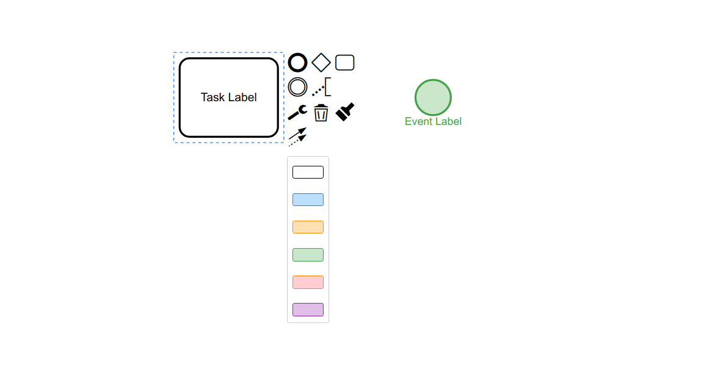

> __Note:__ This example exists for educational purposes only.
>
> Consider using our [built-in color support](https://bpmn.io/blog/posts/2016-colors-bpmn-js.html) to display colors saved in your BPMN 2.0 diagrams.


# bpmn-js in color

This example show cases how to extend [bpmn-js](https://github.com/bpmn-io/bpmn-js) with colors based on the [BPMN in Color proposal](https://github.com/bpmn-miwg/bpmn-in-color).



## Features

* Recognize and display [BPMN in Color](https://github.com/bpmn-miwg/bpmn-in-color) meta-data
* Change color of elements via context pad


## Use Extension

Fetch `bpmn-js-in-color` as a dependency:

```
npm install bpmn-io/bpmn-js-in-color --save
```

Extend your BPMN modeler with colors:

```javascript
var BpmnModeler = require('bpmn-js/lib/Modeler');

var modeler = new BpmnModeler({
  additionalModules: [
    require('bpmn-js-in-color')
  ]
});
```

Add diagram-js, bpmn-font and [color picker](./colors/color-picker.css) stylesheets:

```html
<link rel="stylesheet" href="vendor/diagram-js.css" />
<link rel="stylesheet" href="vendor/bpmn-font/css/bpmn-embedded.css" />
<link rel="stylesheet" href="vendor/colors/color-picker.css" />
```


## Build Demo

To run the live demo in the [`./example` directory](./example) (as shown in the screenshot above) execute:

```
npm run dev
```


## Useful Resources

* [Introduction to bpmn-js](https://bpmn.io/toolkit/bpmn-js/walkthrough/)
* [BPMN in Color proposal](https://github.com/bpmn-miwg/bpmn-in-color)
